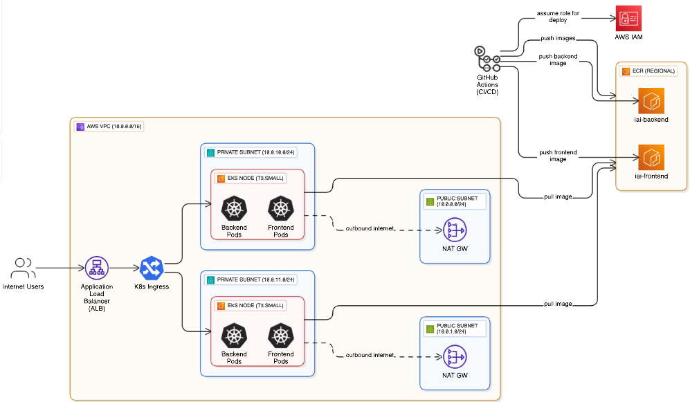

# IAI Project

A production-ready full-stack web application for user management and search functionality. The system consists of a RESTful API backend built with Python Flask and a responsive React frontend, both containerized and deployed to AWS EKS with automated CI/CD pipeline.

## Table of Contents
- [Project Overview](#project-overview)
- [Architecture](#architecture)
- [Technologies](#technologies)
- [Features](#features)
- [Deployment](#deployment)
- [Component Details](#component-details)
- [Monitoring and Health Checks](#monitoring-and-health-checks)
- [Author](#author)

## Project Overview

This application provides a user management interface with search capabilities. The backend exposes a RESTful API for user data operations, while the frontend provides a card-based interface for browsing and searching users. The entire system is containerized using Docker and can be deployed to Kubernetes clusters on AWS EKS.

## Architecture

The application follows a microservices architecture with clear separation between frontend and backend services:



**Request Flow:**
1. User accesses the application through AWS Application Load Balancer
2. ALB routes traffic to Kubernetes cluster ingress
3. Ingress controller distributes requests based on path:
   - API requests (/api/*) go to backend pods
   - Static assets and pages (/*) are served by frontend pods
4. Frontend communicates with backend via Nginx reverse proxy
5. Backend reads user data from JSON file and returns responses

**Infrastructure Components:**
- AWS VPC with public and private subnets across 2 availability zones
- EKS cluster with managed node groups (t3.small instances)
- ECR repositories for Docker images with lifecycle policies
- Application Load Balancer for external traffic
- Separate Kubernetes namespaces for backend and frontend isolation

## Technologies

### Backend Stack
- **Python**
- **Flask**
- **Flask-CORS**
- **Gunicorn**
- **Requests**

### Frontend Stack
- **React**
- **Axios**
- **Nginx 1.25-alpine**

### Infrastructure & DevOps
- **Docker**: Containerization with multi-stage builds
- **Kubernetes**: Container orchestration platform
- **AWS EKS**: Managed Kubernetes service (version 1.28)
- **AWS ECR**: Container image registry with encryption
- **AWS VPC**: Network isolation with NAT gateways
- **AWS ALB**: Application Load Balancer with health checks
- **Terraform**: Infrastructure as Code for AWS resources
- **GitHub Actions**: CI/CD automation pipeline

### Kubernetes Components
- **Deployments**: Replica management for frontend (2 pods) and backend (2 pods)
- **Services**: ClusterIP services for internal communication
- **Ingress**: ALB-based ingress with path routing
- **ConfigMaps**: Environment configuration for backend
- **Namespaces**: Logical separation (backend, frontend, default)

## Features

### Backend API Features
- RESTful API design with JSON responses
- CORS enabled for cross-origin requests
- Multiple endpoints: list all users, get user by ID, search by ID
- Health check endpoint for monitoring
- Error handling with appropriate HTTP status codes
- Structured JSON response format with success flags
- Non-root container execution for security
- Request timeout configuration (60 seconds)
- Access and error logging to stdout/stderr

### Frontend Application Features
- Card-based user interface displaying user information
- Real-time search functionality (filter users by ID)
- Search input with clear button
- Result count display
- Loading states with spinner animations
- Error handling with user-friendly messages
- Nginx reverse proxy for backend API requests
- Static asset caching (1 year expiration)
- React Router support

### DevOps & Infrastructure Features
- Multi-stage Docker builds for optimized image sizes
- Docker health checks for both services
- Kubernetes readiness and liveness probes
- Automated deployment via GitHub Actions on push to main branch
- ECR lifecycle policies (keep last 3 images per repository)
- Infrastructure provisioned via Terraform modules
- Automated aws-auth ConfigMap configuration
- Namespace-based service isolation
- Cross-namespace communication via proxy services
- Automated cleanup scripts for resource destruction
- ALB provisioning with retry logic
- Non-privileged container execution (UID 1000)

## Deployment

### Infrastructure Setup with Terraform

cd terraform
terraform init
terraform plan
terraform apply
```

This creates:
- VPC with 2 public and 2 private subnets
- EKS cluster with managed node group (2 t3.small instances)
- ECR repositories for backend and frontend images
- IAM roles and policies for EKS and ALB controller
- Load Balancer Controller installed via Helm

3. Configure kubectl:
```bash
aws eks update-kubeconfig --region eu-north-1 --name iai-cluster
```

### Automated Deployment with GitHub Actions

The repository includes a GitHub Actions workflow that automatically builds and deploys on push to main branch.

**Setup:**

1. Create GitHub repository secrets:
   - `AWS_ACCESS_KEY_ID`: AWS access key for github-actions-deployer IAM user
   - `AWS_SECRET_ACCESS_KEY`: AWS secret key

2. The workflow will:
   - Build Docker images with commit SHA tags
   - Push images to ECR
   - Update Kubernetes manifests with new image tags
   - Deploy to EKS cluster
   - Wait for rollout to complete
   - Output application URL

### Cleanup

To destroy all AWS resources:

```bash
./destroy-eks-resources.sh
```

This script:
- Deletes Kubernetes ingresses (removes ALB)
- Waits for load balancers to be deleted
- Checks for orphaned security groups
- Runs terraform destroy to remove all infrastructure

## Component Details

### Backend (app.py)

The Flask application provides a RESTful API with the following structure:

- **CORS Configuration**: Enabled for all routes to allow frontend communication
- **Data Storage**: JSON file-based storage (`data/users.json`)
- **Error Handling**: Try-catch blocks with appropriate HTTP status codes
- **Response Format**: JSON structure

### Frontend Components

**App.js**
- Main application component
- Manages global state (users, loading, error, searchId)
- Handles API calls via axios service
- Implements search and load functionality

**SearchBar.js**
- Controlled input component for user ID search
- Search button and clear functionality
- Displays active search query

**UserList.js**
- Container component for user cards
- Displays user count
- Handles empty states

**UserCard.js**
- Displays individual user information
- Card-based layout with user details

**api.js**
- Axios HTTP client configuration
- API endpoint functions (fetchUsers, fetchUserById, searchUserById)
- Centralized error handling


### Kubernetes Configuration

**Namespaces:**
- `backend`: Contains backend deployment, service, and configmap
- `frontend`: Contains frontend deployment and service  
- `default`: Contains ingress and proxy services

**Deployments:**
- 2 replicas each for high availability
- Resource limits: 500m CPU, 512Mi memory
- Readiness probe: HTTP GET to health endpoints
- Liveness probe: HTTP GET with longer timeout
- Rolling update strategy (maxSurge: 1, maxUnavailable: 0)

**Services:**
- ClusterIP type for internal communication
- Backend: Port 5000
- Frontend: Port 80

**Ingress:**
- Two ingress resources (backend and frontend namespaces)
- Group annotation: Share single ALB (alb.ingress.kubernetes.io/group.name)
- Path-based routing: /api/* to backend, /* to frontend
- Health check path configured per service
- Target type: IP (for pod direct routing)

### Terraform Modules

**VPC Module:**
- CIDR: 10.0.0.0/16
- 2 public subnets (10.0.0.0/24, 10.0.1.0/24)
- 2 private subnets (10.0.10.0/24, 10.0.11.0/24)
- Internet gateway for public subnets
- 2 NAT gateways with Elastic IPs for private subnets

**EKS Module:**
- Managed node group: t3.small instances (2 nodes)
- aws-auth ConfigMap automated configuration
- Security groups for cluster and node communication

**ECR Module:**
- Two repositories: iai-backend, iai-frontend
- Image scanning enabled
- Encryption at rest
- Lifecycle policy: Keep last 3 images

**Load Balancer Module:**
- IAM role for ALB controller
- IAM policy with required ELB permissions
- Helm chart installation of AWS Load Balancer Controller 
- Service account with IAM role annotation

## Monitoring and Health Checks

**Kubernetes Liveness Probes:**
- Backend: GET /api/health every 10 seconds
- Frontend: GET /health every 10 seconds
- Restart pod if 3 consecutive failures

**Kubernetes Readiness Probes:**
- Same endpoints as liveness
- Remove pod from service if unhealthy
- Initial delay: 5 seconds for backend, 10 seconds for frontend

**Docker Health Checks:**
- Backend: Python requests to localhost:5000/api/health
- Frontend: wget spider to localhost:8080/health
- Check interval: 30 seconds
- Timeout: 3 seconds
- Unhealthy threshold: 3 retries

**Application Logs:**
- Backend: Gunicorn access and error logs to stdout/stderr
- Frontend: Nginx access and error logs to stdout/stderr
- View with: `kubectl logs -n <namespace> <pod-name>`

## Author

Eyal Chachmishvily
